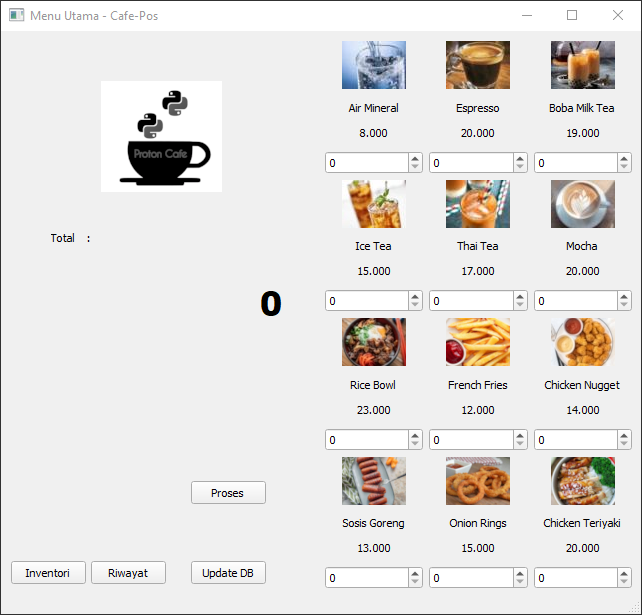

# Cafe-POS

**DISCLAIMER!** The code is a bit mess, but it should works perfectly.



## Requirements

* Python >=3.6 (Tested on Python 3.9)

## How to run ?

### Easy step

* Download this repo
* Open the folder with VSCode
* Run the **initDB.py** then **loginWindow.py**

### Conventional step

Download manually or Git Clone this repo

```shell
git clone https://blablabla
```

Change directory

```shell
cd <yourpath>
```

(Optional) Setting your virtual environments in Windows with Powershell

```powershell
python -m venv c:\path\to\myenv
.\Scripts\Activate.ps1
```

Install pip package (required)

```shell
pip install pyqt5 pyqt5-tools
```

Database initialization

```shell
python initDB.py
```

Run the app

```shell
python loginWindow.py
```
